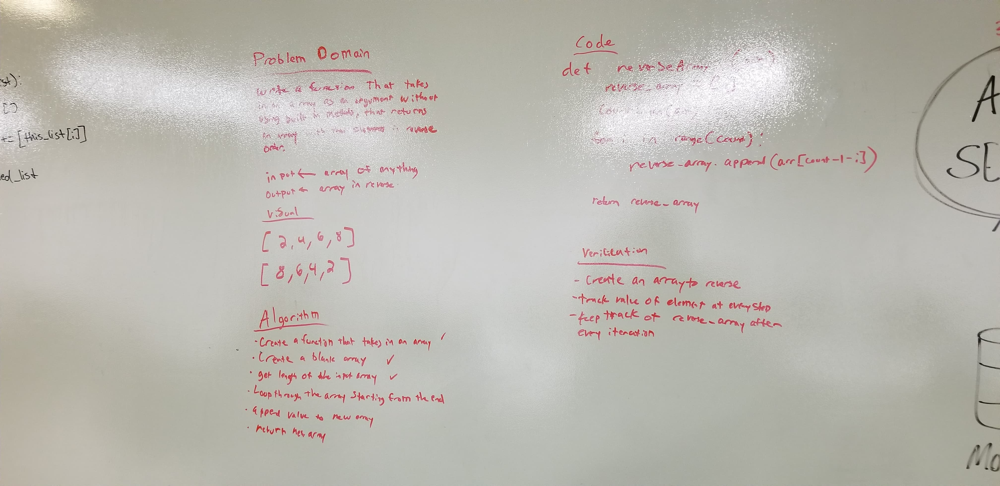

# Reverse an Array

This code will take in an array and print its contents in reverse.

## Challenge

Create a fucntion that takes in an array and reverses it contents without using built in functions.

## Approach & Efficiency

I took in the array looped through the array but I started at the end, grabbed the values and pushed it into a new array. 

## Soultion 
